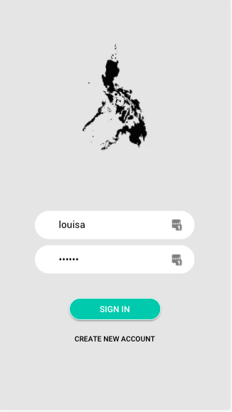

Ionic App - Explore Philippines
=================

This app allows the user to see details of points of interest in the Philippines (currently only available data is in Manila).

Main Functionality:
-----
* User can sign in with a username and password.
* User can open a side menu to access the full destinations list and sign out.
* Destinations list page includes interactive cards that show an image of a point of interest and a short description.
* User can select a card to be taken to a more detailed view, and press the back arrow to go to previous page.

The service fetches API places of interest data, upon user sign in.
This fetch creates PointsOfInterestCards which get generated as cards on the Destinations list page.

Struggles / Improvements to be Made:
-----
* Use an API with more points of interest information, such as https://developer.here.com
* Add a dummy API for end to end testing (haven't been able to test full e2e functionality due to this)
* Broken destinations list unit test due to click event not triggering

How to Install:
-----
* Clone this repo https://github.com/louisaspicer/ionicExplorePhilippines.git
* `cd ionicExplorePhilippines`
* Replace 'API_KEY' in CityInfoServiceProvider with your own key from https://sandbox.amadeus.com/
* Run `ionic serve` in the terminal to open the app in the browser
* Open Developer Tools if you would like to view the app in mobile resolutions

How to run the tests:
-----
* For end-to-end tests, run `ionic serve` first, then `npm run e2e`
* For unit and integration tests, run `npm run test`

Jasmine, Karma and Protractor for unit and e2e testing.

Testing was setup by following: https://leifwells.github.io/2017/08/27/testing-in-ionic-configure-existing-projects-for-testing/ to set up testing foundation

Screenshots:
-----

